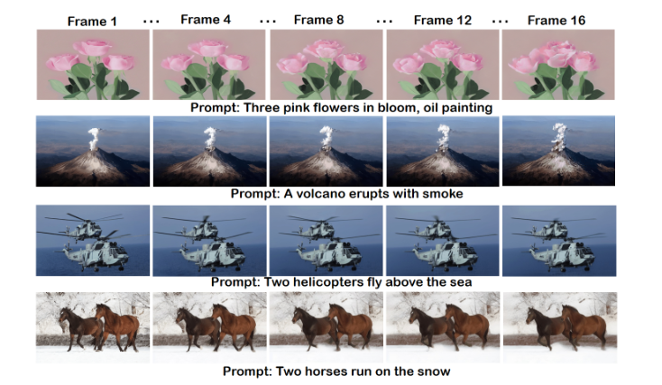
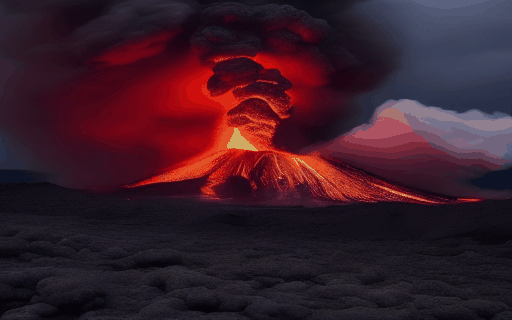
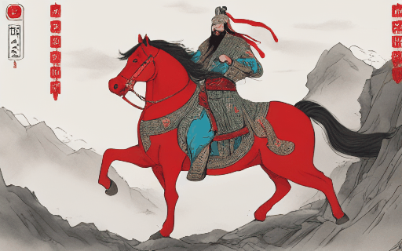
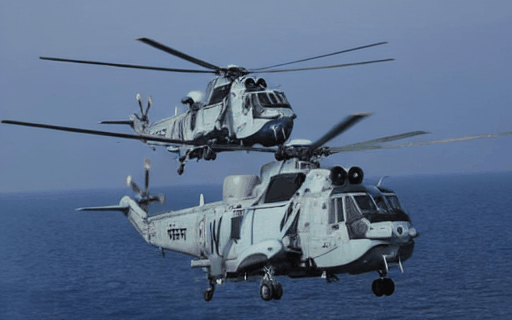

## **Make An Image Move: Few-shot based Video Generation Guided by CLIP**

### Dependencies and Installation

- Ubuntu > 18.04

- CUDA=11.3

- Others:

  ```
  # clone the repo
  https://github.com/FatLong666/MAIM.git
  
  # create virtual environment
  conda create -n MAIM python=3.8
  conda activate MAIM
  
  # install packages
  pip install torch==1.12.1+cu113 torchvision==0.13.1+cu113 torchaudio==0.12.1 --extra-index-url https://download.pytorch.org/whl/cu113
  pip install -r requirements.txt
  pip install xformers==0.0.13
  ```
[ICPR文章.pdf](https://github.com/user-attachments/files/17055596/ICPR.pdf)

  





**Prompt: A volcano erupts with huge smoke, overlook angle.**



**Prompt: A volcano erupts with smoke and lava, dark and red.**



**Prompt: Guan Yu rides a red horse.**


**Prompt: A red flower in bloom, Van Gogh style, oil painting.**



**Prompt: Two helicopters fly above the sea.**


**Prompt: Four helicopters fly on the city.**
