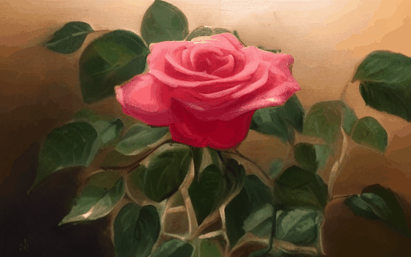
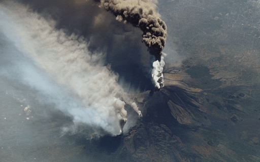

### Abstact

The recent surge in interest surrounding text-to-video diffusion models highlights their capability to generate videos with both consistency and diversity. Current methods focus on leveraging large-scale datasets to align with training videos, while certain approaches explore the potential of zero-shot generation. Few-shot generative models adapt text-to-image model with temporal layers. They can capture the temporal motion and appearance with acceptable computational resources. However, the prevalent few-shot based approaches, which employ a singular prompt for training videos, typically result in inadequate control over complex backgrounds and multiple objects. To overcome this limitation, we introduce a novel component: the dual cross-attention layer. This component leverages CLIP for image feature extraction. The image feature and text feature will be processed independently in dual cross-attention layer, aiming to achieve image reference and enrich the training videos with additional information. This dual cross-attention mechanism empowers the diffusion model to learn both image and text information effectively, facilitating the generation of higher quality videos. Furthermore, we propose an innovative sampling method to enhance temporal consistency and stability of generative videos. Compared to other text-to-video generative models, our framework demonstrates superior efficiency in generating high quality videos with diverse styles. The code is available at https://github.com/FatLong666/MAIM.

#### The ablation analysis of alpha and beta parameters

prompt: A red flower with green leaves in bloom, oil painting style.

|                α=0.2，β=0.1 （our framework）                |                         α=0.4，β=0.1                         |                        α=0.6， β=0.1                         |
| :----------------------------------------------------------: | :----------------------------------------------------------: | :----------------------------------------------------------: |
|  |  |  |
|                         **α=0，β=0**                         |                       **α=0.2, β=0.3**                       |                      **α=0.2， β=0.6**                       |
|  |  |  |

**Prompt: A volcano erupts with huge smoke, overlook angle.**

**Prompt: A volcano erupts with smoke and lava, dark and red.**

**Prompt: Guan Yu rides a red horse.**

**Prompt: A red flower in bloom, Van Gogh style, oil painting.**

**Prompt: A pink flower in bloom, at sunrise.**

**Prompt: Two helicopters fly above the sea.**

**Prompt: Four helicopters fly on the city.**